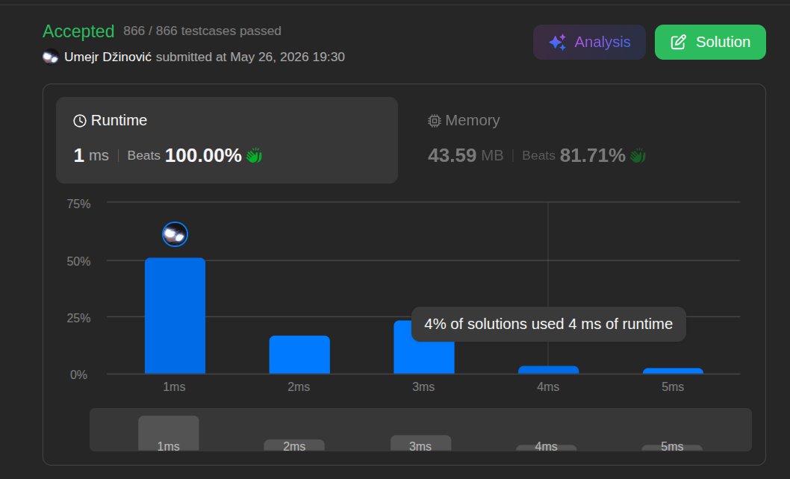

# LeetCode Solution

Ansatz: Fixed-Size Counting
Laufzeit: O(n)
Level: Easy
Memory: O(1)
URL: https://leetcode.com/problems/count-the-number-of-special-characters-i/submissions/2013847732/?envType=daily-question&envId=2026-05-26

## Solution

```java
class Solution {
    public int numberOfSpecialChars(String word) {

        int[] lowercaseLetters = new int[26];
        int[] uppercaseLetters = new int[26];

        for (int i = 0; i < word.length(); i++) {

            char c = word.charAt(i);

            if (Character.isUpperCase(c)) {
                uppercaseLetters[c - 'A']++;
            } else {
                lowercaseLetters[c - 'a']++;
            }
        }

        int res = 0;

        for (int i = 0; i < lowercaseLetters.length; i++) {

             if (lowercaseLetters[i] > 0 && uppercaseLetters[i] > 0) {
                res++;
            }
        }

        return res;
    }
}
```

## Beispiel

<aside>
💡

💡 **Beispiel:** `word = "aaAbcBC"`
• Zählung im ersten Durchlauf:
    ◦ `lowercaseLetters`: 'a' = 2, 'b' = 1, 'c' = 1
    ◦ `uppercaseLetters`: 'A' = 1, 'B' = 1, 'C' = 1
• Abgleich im zweiten Durchlauf:
    ◦ Index 0 ('a'/'A'): Beide > 0 $\rightarrow$ `res++` (1)
    ◦ Index 1 ('b'/'B'): Beide > 0 $\rightarrow$ `res++` (2)
    ◦ Index 2 ('c'/'C'): Beide > 0 $\rightarrow$ `res++` (3)
• Ergebnis: `3`

</aside>

## Ansatz

Der Ansatz nutzt die feste Anzahl von 26 Buchstaben im englischen Alphabet aus. Statt einer dynamischen und speicherintensiven Hash-Tabelle werden zwei feste Integer-Arrays (`size = 26`) initialisiert – eines für Kleinbuchstaben und eines für Großbuchstaben.
In einem einzigen Durchlauf ($O(N)$) wird die Frequenz jedes Zeichens ermittelt, indem der ASCII-Wert des Zeichens relativ zu `'a'` bzw. `'A'` als Index genutzt wird. Anschließend wird in einer konstanten Schleife ($O(26)$) geprüft, bei welchen Indizes sowohl im Klein- als auch im Großbuchstaben-Array ein Wert größer als 0 steht. Jeder Treffer erhöht den Zähler für die "Special Characters".

## Stats

