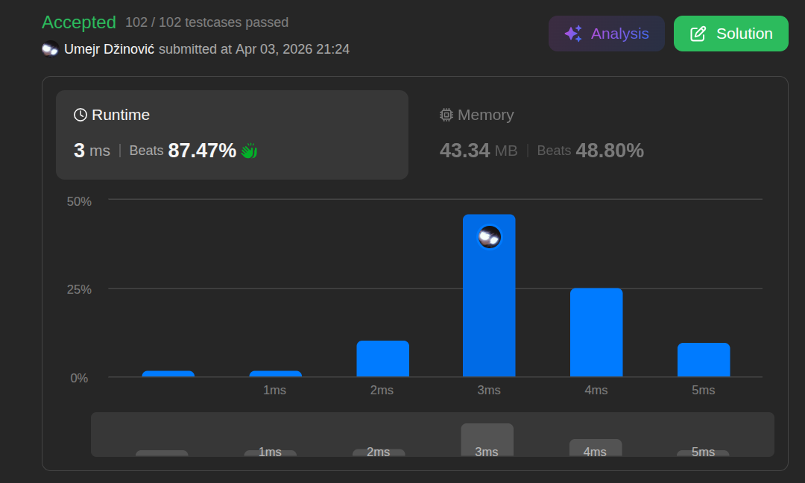

# Brackets

Ansatz: Stack
Laufzeit: O(n)
Level: Easy
Memory: O(n)
URL: https://leetcode.com/problems/valid-parentheses/

## Solution

```java
import java.util.List;
import java.util.ArrayList;

class Solution {
    public boolean isValid(String s) {

        List<Character> charList = new ArrayList<>();

        for (int i = 0; i < s.length(); i++) {

            char c = s.charAt(i);

            if (c == '(' || c == '{' || c == '[') {
                charList.add(c);
                continue;
            }

            if (charList.size() == 0) {
                return false;
            }

            char bracket = charList.get(charList.size() - 1);
            charList.remove(charList.size() - 1);

            if (bracket != '(' && c == ')') {
                return false;
            }
            if (bracket != '{' && c == '}') {
                return false;
            }
            if (bracket != '[' && c == ']') {
                return false;
            }   
        }
        return charList.size() == 0;
    }
}
```

## Beispiel

<aside>
💡

**Beispiel-Input:** `s = "([{}])"`

Wir nutzen die Liste wie einen **Stapel (Stack)**: Wer zuletzt kommt, geht als Erstes (LIFO - Last In, First Out).

1. **'('** : Öffnende Klammer ➜ Ab in die Liste. `List: [(]`
2. **'['** : Öffnende Klammer ➜ Ab in die Liste. `List: [(, []`
3. **'{'** : Öffnende Klammer ➜ Ab in die Liste. `List: [(, [, {]`
4. **'}'** : Schließende Klammer!
    - Schau das letzte Element der Liste an: `{`.
    - Passt es zu `}`? **Ja.** ➜ Entferne `{` aus der Liste. `List: [(, []`
5. **']'** : Schließende Klammer!
    - Letztes Element: `[`. Passt zu `]`? **Ja.** ➜ Entferne `[`. `List: [(]`
6. **')'** : Schließende Klammer!
    - Letztes Element: `(`. Passt zu `)`? **Ja.** ➜ Entferne `(`. `List: []`

**Check am Ende:** Ist die Liste leer? **Ja.** ➜ Alle Klammern wurden korrekt geschlossen! Ergebnis: `true`.

</aside>

## Ansatz

Diese Aufgabe ist das Paradebeispiel für einen **Stack**. Stell dir einen Stapel Teller vor: Du kannst nur den obersten Teller prüfen und wegnehmen.

**Die Logik:**

1. **Öffnen:** Wenn du eine öffnende Klammer siehst, legst du sie auf den Stapel. Du "merkst" dir, was noch geschlossen werden muss.
2. **Schließen:** Wenn eine schließende Klammer kommt, **muss** sie zwingend zur obersten Klammer auf dem Stapel passen.
3. **Fehlerquellen:** * Die Klammer passt nicht zum obersten Element (z.B. `(]` ).
    - Eine schließende Klammer kommt, aber der Stapel ist leer (z.B. `]` ).
    - Am Ende sind noch Klammern auf dem Stapel, die nie geschlossen wurden (z.B. `(()` ).

**Merksatz:**
Nutze einen Stack (Last-In-First-Out). Die letzte Klammer, die geöffnet wurde, muss als allererste wieder geschlossen werden.

## Stats

