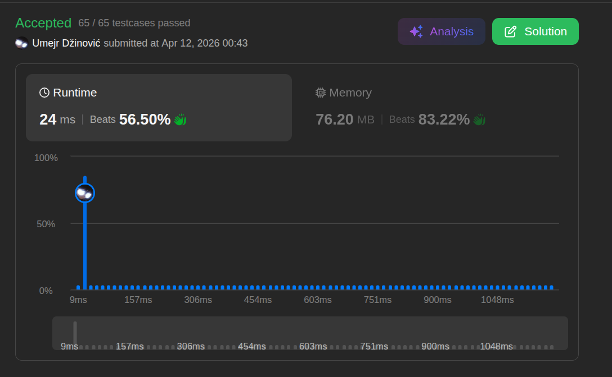

# Contains Dublicate II

Ansatz: Set-Size Sliding Window
Laufzeit: O(n)
Level: Easy
Memory: O(k)
URL: https://leetcode.com/problems/contains-duplicate-ii/

## Solution

```java
class Solution {
    public boolean containsNearbyDuplicate(int[] nums, int k) {

        Set<Integer> window = new HashSet<>();

        for (int i = 0; i < nums.length; i++) {

            if (window.contains(nums[i])) {
                return true;
            }

            window.add(nums[i]);

            if (window.size() > k) {
                window.remove(nums[i - k]);
            }
        }

        return false;

    }
}

```

## Beispiel

<aside>
💡

**Input:** `nums = [1, 2, 3, 1]`, `k = 2`
1. **Schritt 1 ($i=0$):**
    ◦ `window.contains(1)`? Nein.
    ◦ `window.add(1)`. Fenster: `{1}`
2. **Schritt 2 ($i=1$):**
    ◦ `window.contains(2)`? Nein.
    ◦ `window.add(2)`. Fenster: `{1, 2}`
3. **Schritt 3 ($i=2$):**
    ◦ `window.contains(3)`? Nein.
    ◦ `window.add(3)`. Fenster: `{1, 2, 3}`
    ◦ **Check `size > k` ($3 > 2$):** Wir müssen das älteste Element entfernen (`nums[i-k]` $\rightarrow$ `nums[0]`).
    ◦ `window.remove(1)`. Fenster jetzt: `{2, 3}`
4. **Schritt 4 ($i=3$):**
    ◦ `window.contains(1)`? Nein (die alte 1 ist ja schon weg).
    ◦ `window.add(1)`. Fenster: `{2, 3, 1}`
    ◦ **Check `size > k`:** Entferne `nums[3-2]` $\rightarrow$ `nums[1]` (die 2).
    ◦ `window.remove(2)`. Fenster jetzt: `{3, 1}`
**Ergebnis:** `false`. (Wäre $k=3$ gewesen, hätten wir die 1 im Fenster gefunden, bevor wir sie gelöscht hätten!)

</aside>

## Ansatz

1. **Check:** Prüfe mit `contains`, ob die aktuelle Zahl im Set ist. Wenn ja: `return true`. Da das Set nie ältere Zahlen als `k` speichert, ist die Abstands-Bedingung automatisch erfüllt.
2. **Add:** Füge die Zahl zum Set hinzu.
3. **Sliding (Das Fenster schieben):** Wenn die Größe des Sets `k` überschreitet, entferne das Element, das jetzt "aus dem Fenster" rutscht. Das ist immer das Element an der Stelle `i - k`.

**Warum das effizient ist:**

- **Laufzeit (Time):** **O(n)**. Wir gehen einmal durch das Array. Jede Operation im HashSet (add, contains, remove) dauert im Schnitt **O(1)**.
- **Speicher (Space):** **O(k)**. Unser Set speichert nie mehr als k Elemente, egal wie groß das Eingabe-Array ist.

Nochmal: 

### 1. Set**-Size** (Feste Size)

Das Fenster hat eine **feste Breite**, die durch **k** vorgegeben ist. In deinem Code sorgt die Bedingung `if (window.size() > k)` dafür, dass das "Gedächtnis" (dein HashSet) niemals breiter wird als diese k-Schranke. Es wächst nicht unendlich mit dem Array mit, sondern bleibt starr auf dieser Größe.

### 2. **Sliding** (Gleitend)

Stell dir vor, du hast einen langen Papierstreifen mit Zahlen und einen kleinen Plastikrahmen (das Fenster). Du schiebst diesen Rahmen immer **einen Schritt nach rechts**.

- Das Fenster "gleitet" über die Daten.
- Es springt nicht, sondern rückt flüssig vor.

### 3. **Window** (Fenster)

Man nennt es Fenster, weil du zu jedem Zeitpunkt **nur einen Ausschnitt** der gesamten Daten "siehst" oder im Zugriff hast. Alles, was links aus dem Fenster herausfällt, existiert für deinen aktuellen Rechenschritt nicht mehr (du löscht es mit `window.remove`).

## Stats

