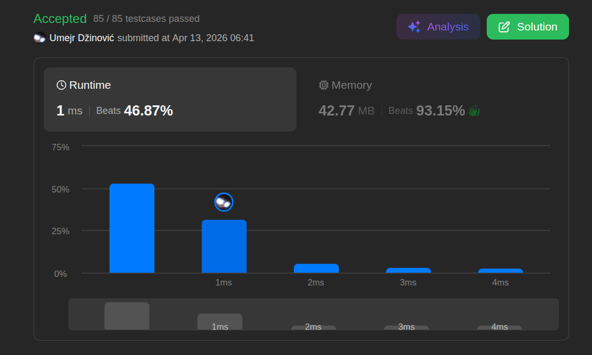

# Find the Index of the First Occurrence in a String

Ansatz: Nested Schleifen, Set-Size Sliding Window
Laufzeit: O(n * m)
Level: Easy
Memory: O(1)
URL: https://leetcode.com/problems/find-the-index-of-the-first-occurrence-in-a-string/

## Solution

```java
class Solution {
    public int strStr(String haystack, String needle) {

        // sadbutsad
        int hLen = haystack.length();
        int nLen = needle.length();

        for (int i = 0; i <= hLen - nLen; i++) {
            
            int j = 0;
            while(j < nLen && haystack.charAt(i + j) == needle.charAt(j)) {
                j++;
            }

            if (j == nLen) {
                return i;
            }

        }

        return -1;
        
    }
}
```

## Beispiel

<aside>
💡

**Input:**
• `haystack` = `"hello"` (Länge $n=5$)
• `needle` = `"ll"` (Länge $m=2$)
**Der Ablauf (Schritt für Schritt)**
1. **Check Index 0 (`h`):**
    ◦ Fenster: `[he]llo`
    ◦ Vergleich: `"he"` == `"ll"`? **Nein.**
2. **Check Index 1 (`e`):**
    ◦ Fenster: `h[el]lo`
    ◦ Vergleich: `"el"` == `"ll"`? **Nein.**
3. **Check Index 2 (`l`):**
    ◦ Fenster: `he[ll]o`
    ◦ Vergleich: `"ll"` == `"ll"`? **JA!**
    ◦ **Return 2**
*Hinweis:* Wir müssten bei Index 4 gar nicht mehr prüfen, da dort nur noch ein Buchstabe (`"o"`) übrig ist, die `needle` aber 2 braucht. (Deshalb `i <= hLen - nLen`).

</aside>

## Ansatz

> **💡 Das "Reset-Fenster" (Brute Force Sliding Window)**
> 
> 
> Da wir einen exakten Substring suchen, schieben wir ein Fenster der Größe der `needle` über den gesamten Text.
> 
> 1. **Äußere Schleife (i):** Bestimmt den Startpunkt im `haystack`. Wir laufen von `0` bis `haystack.length - needle.length`.
> 2. **Innere Prüfung (j):** Ab jedem Startpunkt `i` vergleichen wir die nächsten Zeichen.
>     - Wenn ein Zeichen nicht passt: **Abbruch** der inneren Prüfung.
>     - Die äußere Schleife springt zum nächsten Index (`i + 1`) und wir fangen bei der `needle` wieder bei `0` an.
> 3. **Erfolg:** Wenn wir die gesamte Länge der `needle` erfolgreich verglichen haben, geben wir den aktuellen Startindex `i` zurück.
> 
> **Warum das "Mississippi"-Problem gelöst ist:**
> Weil wir nicht versuchen, schlau zu springen. Wenn ein Versuch scheitert, gehen wir stur zum **nächsten** Buchstaben im Text zurück. Das ist zwar "rohe Gewalt" (Brute Force), aber es übersieht niemals einen Treffer.
> 

## Stats

