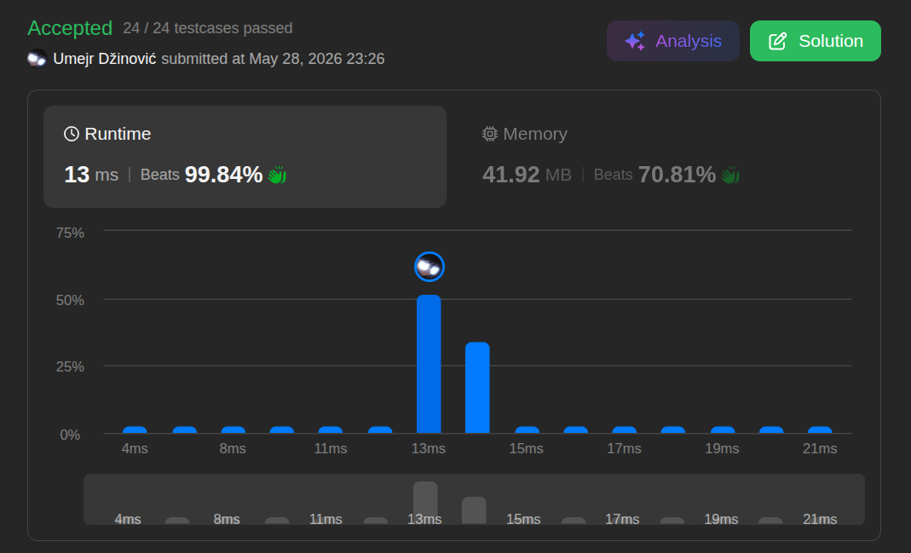

# First bad version

Ansatz: Binary Search
Laufzeit: O(log n)
Level: Easy
Memory: O(1)
URL: https://leetcode.com/problems/first-bad-version/

## Solution

```java
/* The isBadVersion API is defined in the parent class VersionControl.
      boolean isBadVersion(int version); */

public class Solution extends VersionControl {
    public int firstBadVersion(int n) {

        int left = 1;
        int right = n;

        while(left < right) {

            int mid = left + (right - left) / 2;

            if (isBadVersion(mid)) {
                right = mid;
            }   else {
                left = mid + 1;
            }
        }

        return left;
        
    }
}
```

## Beispiel

<aside>
💡

💡 **Beispiel-Durchlauf ([G, G, S, S] mit n=4):**

1. **Start:** `left = 1`, `right = 4`, `mid = 2`. `isBadVersion(2)` ist `false` -> `left` wird `3`.
2. **Schritt 2:** `left = 3`, `right = 4`, `mid = 3`. `isBadVersion(3)` ist `true` -> `right` wird `3`.
3. **Ende:** `left` und `right` sind beide `3`. Schleife terminiert. Ergebnis: `3`.
</aside>

## Ansatz

Die Herausforderung besteht darin, die erste `true`-Version in einer sortierten Reihe von `false` und `true` Werten zu finden, ohne unnötige API-Aufrufe zu tätigen.

- **Binäre Suche:** Anstatt linear zu suchen, halbieren wir den Suchbereich kontinuierlich.
- **Die Logik:** Wenn `isBadVersion(mid)` wahr ist, wissen wir, dass die erste schlechte Version entweder `mid` selbst oder links davon liegt. Wir setzen `right = mid`. Ist sie hingegen falsch, liegt die erste schlechte Version sicher rechts von `mid`, also `left = mid + 1`.
- **Abbruchbedingung:** Durch `left < right` stellen wir sicher, dass die Schleife genau dann stoppt, wenn beide Zeiger auf das erste Vorkommen von `true` konvergieren.

**Merksatz:**
Verwende bei der Suche nach einem Grenzwert (erster Treffer) `left < right` und setze `right = mid`. Das vermeidet Endlosschleifen und unnötige "Look-ahead"-Prüfungen.

## Stats

