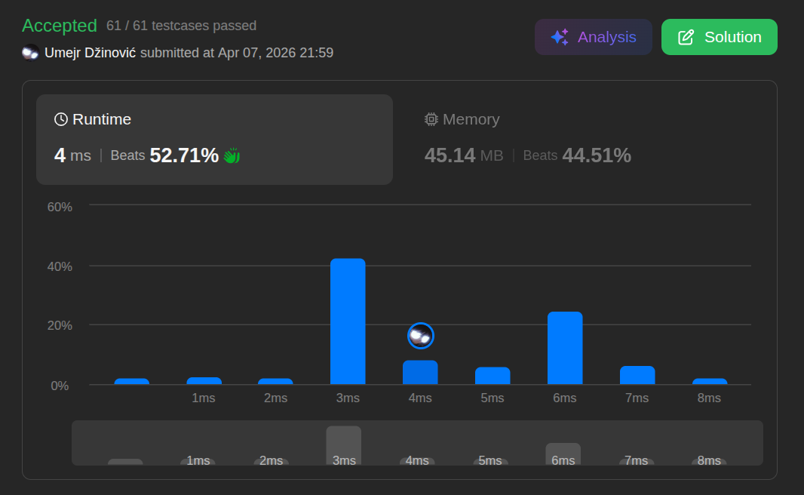

# Intersection of Two Arrays II

Ansatz: Hash
Laufzeit: O(n + m)
Level: Easy
Memory: O(n)
URL: https://leetcode.com/problems/intersection-of-two-arrays-ii/description/

## Solution

```java
class Solution {
    public int[] intersect(int[] nums1, int[] nums2) {

        Map<Integer, Integer> numbers = new HashMap<>();
        List<Integer> result = new ArrayList<>();

        for (int i = 0; i < nums1.length; i++) {

            numbers.merge(nums1[i], 1, (oldValue, one) -> oldValue + one);

        }

        for (int i = 0; i < nums2.length; i++) {
   
            numbers.computeIfPresent(nums2[i], (k, val) -> {
                if (val > 0) {
                    result.add(k);
                }
                return val - 1;
            });

        }

        int[] resultArray = new int[result.size()];

        for (int i = 0; i < resultArray.length; i++) {
            resultArray[i] = result.get(i);
        }

        return resultArray;
    }
}
```

## Beispiel

<aside>
💡

**Beispiel-Input:** nums1 = [1, 2, 2, 1], nums2 = [2, 2]

1. **Phase 1 (Inventar von nums1):**
    - Wir gehen durch [1, 2, 2, 1].
    - Unsere Map speichert: {1: 2, 2: 2} (Die 1 kommt zweimal vor, die 2 kommt zweimal vor).
2. **Phase 2 (Abgleich mit nums2):**
    - Wir prüfen die erste Zahl von nums2: **2**.
    - Ist die 2 in der Map? Ja, Wert ist 2.
    - **Aktion:** Wir fuegen die 2 zum Ergebnis hinzu und setzen den Wert in der Map auf 1.
    - Wir prüfen die zweite Zahl von nums2: **2**.
    - Ist die 2 in der Map? Ja, Wert ist noch 1.
    - **Aktion:** Wir fuegen die 2 zum Ergebnis hinzu und setzen den Wert in der Map auf 0.

**Endergebnis:** [2, 2]

</aside>

## Ansatz

Der Unterschied zur einfachen Schnittmenge ist, dass wir hier die **Haeufigkeit** (Frequenz) beachten muessen. Wenn eine Zahl in beiden Arrays mehrmals vorkommt, muss sie auch mehrmals im Ergebnis stehen.

**Die Logik:**

1. **Zaehlen:** Nutze eine HashMap, um zu speichern, wie oft jede Zahl im ersten Array vorkommt. (Key = Zahl, Value = Anzahl).
2. **Abgleichen:** Laufe durch das zweite Array. Wenn eine Zahl in der Map existiert und der Zaehler groesser als 0 ist, gehoert sie zur Schnittmenge.
3. **Reduzieren:** Jedes Mal, wenn du eine Zahl matchst, musst du ihren Zaehler in der Map um 1 verringern ("ein Stueck aus dem Lager entnehmen"), damit du nicht mehr Paare bildest, als vorhanden sind.

**Merksatz:**
Stell dir die erste Map wie ein Lagerhaus vor. Das zweite Array ist eine Bestellung. Du kannst nur das ausliefern, was auch wirklich im Lager liegt.

## Stats

