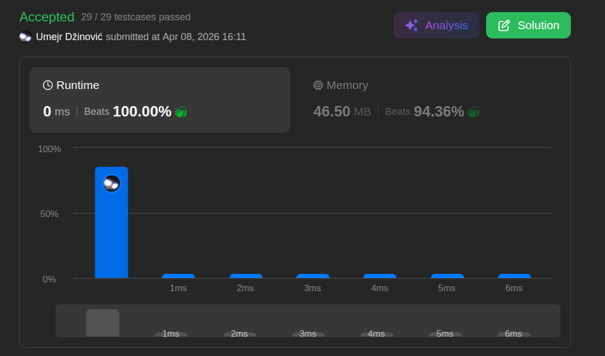

# Linked List Cycle

Ansatz: Singly Linked List, Zwei Zeiger
Laufzeit: O(n)
Level: Easy
Memory: O(1)
URL: https://leetcode.com/problems/linked-list-cycle/description/

## Solution

```java
/**
 * Definition for singly-linked list.
 * class ListNode {
 *     int val;
 *     ListNode next;
 *     ListNode(int x) {
 *         val = x;
 *         next = null;
 *     }
 * }
 */
public class Solution {
    public boolean hasCycle(ListNode head) {
        if (head == null) return false;

        ListNode slow = head; // will always move 1 forward
        ListNode fast = head; // will always move 2 forward

        // Lets say there is a node difference of 5:
        // 5 - 2 (fast) + 1 (slow) = 4
        while (fast != null && fast.next != null) {
            slow = slow.next;      
            fast = fast.next.next;  

            if (slow == fast) {
                return true;
            }
        }

        return false;
    }
}
```

## Beispiel

<aside>
💡

Warum treffen sie sich garantiert?
1. **Relativer Abstand:** Stell dir vor, beide sind im Kreis. Der Hase (`fast`) ist hinter dem Igel (`slow`).
2. **Die Annäherung:** In jedem Schritt verringert der Hase den Abstand zum Igel um **genau 1 Knoten** ($2 \text{ Schritte} - 1 \text{ Schritt} = 1$).
3. **Kein Überspringen:** Da der Abstand eine ganze Zahl ist (z. B. 5, 4, 3, 2, 1, 0) und sich immer nur um 1 verringert, kann der Hase den Igel **niemals überspringen**. Er landet zwangsläufig bei einem Abstand von **0**.
4. **Das Treffen:** Bei Abstand 0 zeigen beide Pointer auf dieselbe Speicheradresse (`slow == fast`).

</aside>

## Ansatz

Man braucht kein "Gedächtnis" (HashSet), um Zyklen zu finden. Die Physik der Relativgeschwindigkeit reicht aus.

- **Zwei Zeiger:** Wir nutzen zwei Zeiger mit unterschiedlichen Geschwindigkeiten.
- **Das Ende:** Wenn es keinen Kreis gibt, wird der schnelle Zeiger (`fast`) als Erster `null` erreichen.
- **Der Kreis:** Wenn es einen Kreis gibt, wird der schnelle Zeiger den langsamen Zeiger irgendwann "überrunden" (wie bei einer Überrundung im Sport).

**Merksatz:**
In einem Kreis holt der Schnellere den Langsameren immer ein, solange der Geschwindigkeitsunterschied konstant und kleinschrittig genug ist.

## Stats

