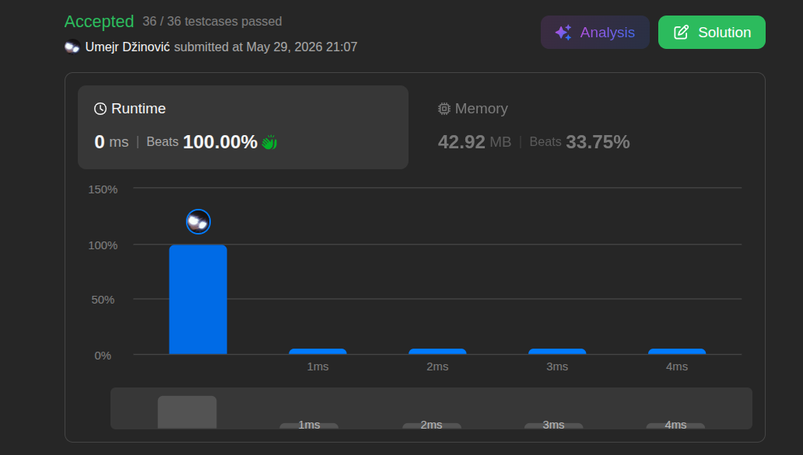

# Middle of Linked List

## Solution

```java
/**
 * Definition for singly-linked list.
 * public class ListNode {
 *     int val;
 *     ListNode next;
 *     ListNode() {}
 *     ListNode(int val) { this.val = val; }
 *     ListNode(int val, ListNode next) { this.val = val; this.next = next; }
 * }
 */
class Solution {
    public ListNode middleNode(ListNode head) {

        ListNode slow = head;
        ListNode fast = head;

        while(fast != null && fast.next != null) {
            slow = slow.next;
            fast = fast.next.next;
        }

        return slow;

    }
}
```

## Beispiel

<aside>
💡

💡 **Beispiel (1 -> 2 -> 3 -> 4 -> 5):**

1. **Start:** `slow = 1`, `fast = 1`.
2. **Schritt 1:** `slow` bewegt sich zu 2, `fast` bewegt sich zu 3.
3. **Schritt 2:** `slow` bewegt sich zu 3, `fast` bewegt sich zu 5.
4. **Ende:** `fast.next` ist `null`. Schleife terminiert. Ergebnis: `slow` zeigt auf 3.
</aside>

## Ansatz

Die Herausforderung besteht darin, die Mitte der Liste mit nur einem Durchlauf zu finden ("Tortoise and Hare"-Algorithmus).
• **Zwei-Pointer-Technik:** Ein langsamer Pointer (`slow`) und ein schneller Pointer (`fast`) starten am selben Punkt.
• **Die Logik:** Der schnelle Pointer bewegt sich doppelt so schnell ($2$ Schritte pro Iteration) wie der langsame ($1$ Schritt pro Iteration).
• **Abbruchbedingung:** Sobald der schnelle Pointer das Ende der Liste erreicht hat, befindet sich der langsame Pointer mathematisch exakt in der Mitte.
**Merksatz:**
Nutze für die Suche nach einem Mittelpunkt oder Zyklus in einer Linked List zwei Pointer mit unterschiedlicher Geschwindigkeit, um Zeit und Speicher zu sparen.

## Stats

