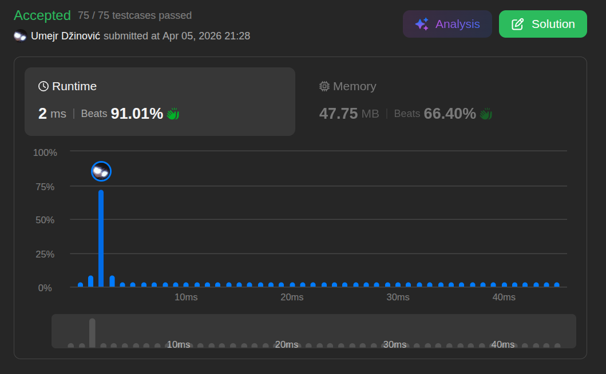

# Move Zeroes

Ansatz: Zwei Zeiger
Laufzeit: O(n)
Level: Easy
Memory: O(1)
URL: https://leetcode.com/problems/move-zeroes/

## Solution

```
class Solution {
    public void moveZeroes(int[] nums) {

        int i = 0;

        // [1,0,1]
        for (int l = 0; l < nums.length; l++) {

            if (nums[l] != 0) {
                int saveNumber = nums[i];
                nums[i] = nums[l];
                nums[l] = saveNumber;
                i++;
            } 
        
        }
    }
}
```

## Beispiel

<aside>
💡

Wir nutzen zwei Zeiger: `i` (zeigt auf die nächste Stelle für eine Nicht-Null) und `l` (scannt das Array).

1. **Start:** `i = 0`, `l = 0`.
2. **Check (l=0, Wert 0):** Ist 0 ungleich 0? **Nein.**
    - Nichts passiert. `l` rückt vor.
3. **Check (l=1, Wert 1):** Ist 1 ungleich 0? **Ja!**
    - **Swap:** Tausche `nums[i]` (0) mit `nums[l]` (1).
    - Array: `[1, 0, 0, 3, 12]`.
    - `i` rückt vor auf Index 1.
4. **Check (l=2, Wert 0):** Ist 0 ungleich 0? **Nein.**
    - `l` rückt vor.
5. **Check (l=3, Wert 3):** Ist 3 ungleich 0? **Ja!**
    - **Swap:** Tausche `nums[i]` (die 0 an Index 1) mit `nums[l]` (die 3 an Index 3).
    - Array: `[1, 3, 0, 0, 12]`.
    - `i` rückt vor auf Index 2.
6. **Check (l=4, Wert 12):** Ist 12 ungleich 0? **Ja!**
    - **Swap:** Tausche `nums[i]` (die 0 an Index 2) mit `nums[l]` (die 12 an Index 4).
    - Array: `[1, 3, 12, 0, 0]`.

**Ergebnis:** Alle Nullen sind am Ende, die Reihenfolge bleibt gleich.

</aside>

## Ansatz

Die Herausforderung ist, die Nullen nach hinten zu schieben, ohne die Reihenfolge der anderen Zahlen zu zerstoeren und ohne extra Speicher zu nutzen.

**Die Logik:**

1. **Lese-Pointer (l):** Er laeuft durch das ganze Array und sucht nach Zahlen, die keine Null sind.
2. **Schreib-Pointer (i):** Er markiert die Position, an der die naechste "gute" Zahl (ungleich Null) stehen sollte.
3. **Der (Tausch):** Sobald der Lese-Pointer eine Zahl ungleich 0 findet, tauscht er sie mit der Stelle, an der der Schreib-Pointer steht. Dadurch "wandern" die Nullen automatisch Schritt fuer Schritt nach rechts, waehrend die Zahlen nach links ruecken.

**Merksatz:**
Nutze den Schreib-Pointer als Parkplatz fuer die naechste Zahl ungleich Null. Jedes Mal, wenn du eine Zahl findest, parkst du sie dort und schiebst die Null, die dort vorher stand, nach hinten.

## Stats

