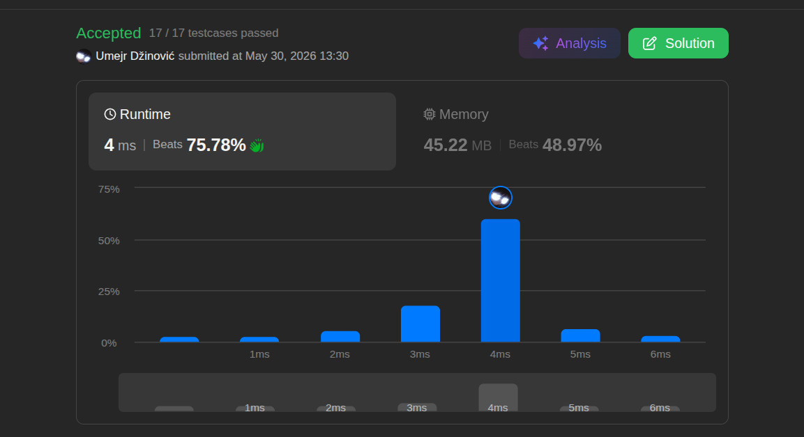

# Next Greater Element I

Ansatz: Hash, Monotonic Stack, Stack
Laufzeit: O(n + m)
Level: Easy
Memory: O(n)
URL: https://leetcode.com/problems/next-greater-element-i/

## Solution

```java
class Solution {
    public int[] nextGreaterElement(int[] nums1, int[] nums2) {

        HashMap<Integer, Integer> indizes = new HashMap<>();
        Stack<Integer> stack = new Stack<>();

        for (int num : nums2) {

            while(!stack.isEmpty() && stack.peek() < num) {
                indizes.put(stack.pop(), num);
            }

            stack.push(num);
        }
        
        int[] result = new int[nums1.length];

        for (int i = 0; i < nums1.length; i++) {
            result[i] = indizes.getOrDefault(nums1[i], -1);
        }

        return result;
    }
}
```

## Beispiel

<aside>
💡

| **Schritt** | **num** | **Stack (vorher)** | **Bedingung peek() < num** | **Aktion** | **Map (Ergebnis)** |
| --- | --- | --- | --- | --- | --- |
| 1 | 2 | `[]` | Stack ist leer | Push 2 | - |
| 2 | 1 | `[2]` | `2 < 1` -> False | Push 1 | - |
| 3 | 3 | `[2, 1]` | `1 < 3` -> True
`2 < 3` -> True | Pop 1, Map `1:3`
Pop 2, Map `2:3`
Push 3 | `1:3`
`2:3` |
</aside>

## Ansatz

Dieses Problem lässt sich extrem effizient mit einem **Monotonic Stack** in Kombination mit einer **HashMap** lösen, um verschachtelte Schleifen zu vermeiden.
• **Monotonic Stack (Das "Wartezimmer"):** Der Stack dient als temporärer Speicher für alle Zahlen, die noch auf ein größeres Element auf ihrer rechten Seite warten. Durch das LIFO-Prinzip (Last-In-First-Out) wird sichergestellt, dass immer das zuletzt hinzugefügte Element als erstes mit einer neuen, potenziell größeren Zahl verglichen wird.
• **Die `while`-Schleife:** Wenn eine neue Zahl `num` aus `nums2` eingelesen wird, prüfen wir kontinuierlich, ob diese größer ist als das oberste Element im Stack (`stack.peek()`). Solange dies der Fall ist, haben wir das "Next Greater Element" für diese wartenden Zahlen gefunden.
• **HashMap als Nachschlagewerk:** Sobald ein größeres Element gefunden wurde, entfernen wir die alte Zahl mit `stack.pop()` aus dem Stack und speichern das Paar `(Zahl, Größere Zahl)` direkt in der HashMap.
• **Schneller Abruf:** Im letzten Schritt iterieren wir nur noch über `nums1` und rufen die vorbereiteten Ergebnisse in $O(1)$ aus der HashMap ab. Wenn eine Zahl nicht in der Map existiert, bedeutet das, sie blieb bis zum Schluss im Stack und hat kein größeres Element gefunden $\rightarrow$ Wir weisen `-1` zu (`getOrDefault`).

## Stats

