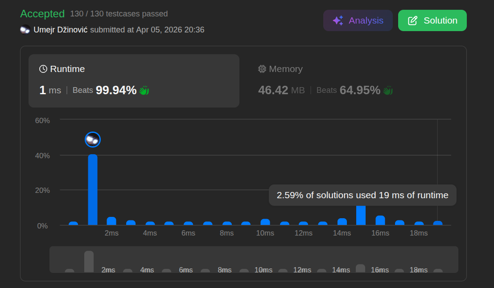

# Note

Ansatz: Einfache iteration
Laufzeit: O(n)
Level: Easy
Memory: O(1)
URL: https://leetcode.com/problems/ransom-note/description/

## Solution

```java
class Solution {
    public boolean canConstruct(String ransomNote, String magazine) {

        int[] counts = new int[26];
        
        for (char c : magazine.toCharArray()) {
            counts[c - 'a']++; 
        }
        
        for (char c : ransomNote.toCharArray()) {
            counts[c - 'a']--;
            
            if (counts[c - 'a'] < 0) {
                return false;
            }
        }
        
        return true;
    }
}
```

## Beispiel

<aside>
💡

**Input:** `ransomNote = "aa"`, `magazine = "aab"`
1. **Magazin scannen:**
    ◦ 'a' gefunden ➜ `counts[0]` wird 1.
    ◦ 'a' gefunden ➜ `counts[0]` wird 2.
    ◦ 'b' gefunden ➜ `counts[1]` wird 1.
    ◦ (Alle anderen 23 Plätze bleiben 0).
2. **Brief scannen:**
    ◦ 'a' benötigt ➜ `counts[0]` sinkt auf 1. (Immer noch $\geq$ 0, also OK).
    ◦ 'a' benötigt ➜ `counts[0]` sinkt auf 0. (Immer noch $\geq$ 0, also OK).
3. **Ergebnis:** Alle Buchstaben wurden gefunden ➜ `true`.

</aside>

## Ansatz

Der Fehler bei O(n²) Lösungen ist meistens, dass man für jeden Buchstaben im Brief das ganze Magazin neu durchsucht (Schleife in einer Schleife).

**Die ideale Strategie:**

1. **Bestandsaufnahme:** Erstelle ein Inventar. Gehe einmal durch das Magazin und notiere in einem Array oder einer HashMap: "Ich habe 5-mal A, 2-mal B, etc."
2. **Abgleich:** Gehe danach einmal separat durch den Brief. Für jeden Buchstaben schaust du in dein Inventar und ziehst eins ab.
3. **Check:** Wenn das Inventar für einen Buchstaben ins Minus geht, bedeutet das, der Buchstabe war im Magazin nicht oft genug vorhanden.

**Merksatz:**
Zähle erst, was du hast (Magazin), und ziehe dann ab, was du brauchst (Brief). Zwei separate Schleifen nacheinander sind viel schneller als verschachtelte Schleifen!

## Stats

