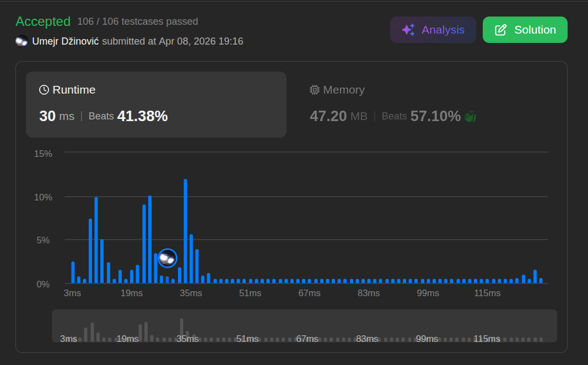

# Remove All Adacent Dublicates In String

Ansatz: Stack
Laufzeit: O(n)
Level: Easy
Memory: O(n)
URL: https://leetcode.com/problems/remove-all-adjacent-duplicates-in-string/

## Solution

```java
import java.util.List;
import java.util.ArrayList;
import java.util.*;
import java.util.stream.Collectors;

class Solution {
    public String removeDuplicates(String s) {

        List<Character> chars = new ArrayList<>();
        
        for (int i = 0; i < s.length(); i++) {
            char c = s.charAt(i);
           
            if (chars.size() > 0 && c == chars.getLast()) {
                chars.remove(chars.size() - 1);
            } else {
                chars.add(c);
            }
        }

        return chars.stream()
                    .map(String::valueOf)
                    .collect(Collectors.joining());
    }
}
```

## Beispiel

<aside>
💡

**Warum funktioniert ein Stapel (Stack) hier so gut?**

- **Dynamische Nachbarschaft:** Wenn man ein Paar entfernt (z. B. `bb` in `abbaca`), entstehen neue Nachbarn (`a` und `a`), die vorher getrennt waren. Ein Stack "merkt" sich die Historie.
- **Beispiel-Durchlauf (`"abbaca"`):**
    1. `a` kommt auf den leeren Stapel. (Stapel: `[a]`)
    2. `b` kommt. `b != a`, also ab auf den Stapel. (Stapel: `[a, b]`)
    3. `b` kommt. **Vergleich:** `b == Top (b)`. **Paar gefunden!** Wir löschen das `b` vom Stapel. (Stapel: `[a]`)
    4. `a` kommt. **Vergleich:** `a == Top (a)`. **Nächstes Paar gefunden!** Wir löschen das `a` vom Stapel. (Stapel: `[]`)
    5. `c` kommt auf den leeren Stapel. (Stapel: `[c]`)
    6. `a` kommt. `a != c`, also ab auf den Stapel. (Stapel: `[c, a]`)
    - **Endergebnis:** `"ca"`
</aside>

## Ansatz

Man muss nicht den ganzen String immer wieder von vorne scannen. Ein einziger Durchlauf reicht aus.

- **Der Speicher:** Nutze einen `StringBuilder` (oder einen echten Stack) als Zwischenspeicher für alle Buchstaben, die (noch) kein Duplikat gefunden haben.
- **Der Vergleich:** Bevor ein Buchstabe hinzugefügt wird, prüft man: `Ist der Stapel leer?` und `Ist das letzte Element identisch?`.
- **Die Entscheidung:**
    - **Gleich:** Das Paar wird vernichtet. Das letzte Element wird aus dem Speicher gelöscht (**Pop**).
    - **Ungleich:** Der Buchstabe wird am Ende hinzugefügt (**Append/Push**).

**Merksatz:**
Ein Stack ist wie ein Gedächtnis, das nur das letzte Ereignis prüft. Wenn das Neue dem Letzten gleicht, wird beides vergessen.

## Stats

