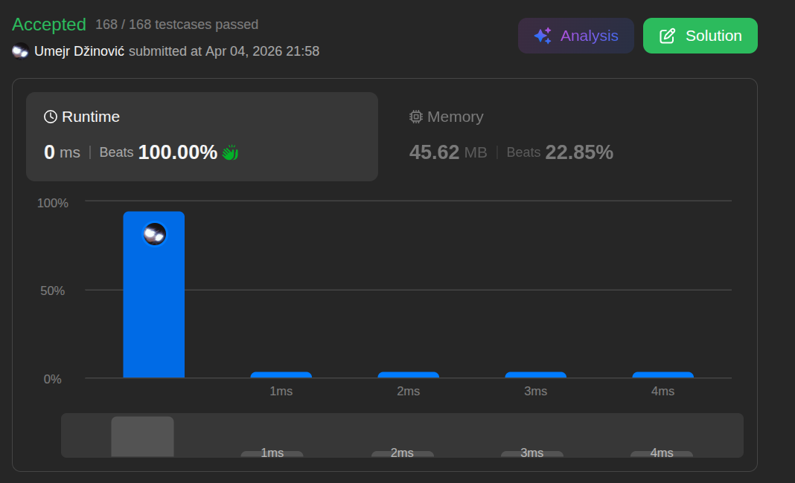

# Remove Dublicates from Sorted List

Ansatz: Singly Linked List, Zwei Zeiger
Laufzeit: O(n)
Level: Easy
Memory: O(1)
URL: https://leetcode.com/problems/remove-duplicates-from-sorted-list/

## Solution

```java
class Solution {
    public ListNode deleteDuplicates(ListNode head) {
        
        // 1, 1, 1, 2, 3, 4
        // 1 -> 1 -> 1 -> 2 -> 3 -> 4
        // [1,2,3,3]
        ListNode start = head; // our return
        ListNode i = head; // 0

        if (i == null) {
            return start;
        }

        ListNode j = head.next; // 1

        while (i != null && j != null) {

            if (i.val != j.val) {
                i.next = j;
                i = i.next;
            }

            if (i.val == j.val && j.next == null) {
                i.next = null;
            } 

            j = j.next;

        }   

        return start;

    }
}
```

## Beispiel

<aside>
💡

**Beispiel-Input:** `1 -> 1 -> 2 -> 3 -> 3`

1. **Start:** `i` steht auf der ersten 1. `j` steht auf der zweiten 1.
2. **Vergleich:** `i.val (1)` ist gleich `j.val (1)`. Wir tun nichts, außer `j` einen Schritt weiterzubewegen.
3. **Nächster Schritt:** `j` steht nun auf der 2.
4. **Vergleich:** `i.val (1)` ist **nicht** gleich `j.val (2)`.
    - **Aktion:** Wir biegen den Pfeil von `i` direkt zur 2 um (`i.next = j`).
    - **Rücken:** `i` springt jetzt auch auf die 2.
5. **Ende:** Sobald `j` das Ende der Liste erreicht, stellen wir sicher, dass `i.next` auf `null` zeigt, damit keine alten Duplikate mehr hinten dran hängen.
</aside>

## Ansatz

Da die Liste **sortiert** ist, müssen alle Duplikate direkt hintereinander liegen. Wir brauchen also nur einen "Anker" (`i`) und einen "Entdecker" (`j`).

**Die Logik:**

- Lass `j` so lange vorlaufen, bis es einen Wert findet, der anders ist als der von `i`.
- Sobald ein neuer Wert gefunden wurde, "überspringen" wir alle Duplikate dazwischen, indem wir `i.next` direkt auf `j` setzen.
- Wiederhole das, bis `j` am Ende der Liste angekommen ist.

**Merksatz:**
Zieh den Pfeil vom aktuellen Knoten einfach so weit nach vorne, bis er den nächsten *neuen* Wert trifft. Alles dazwischen wird vom Garbage Collector deleted.

## Stats

