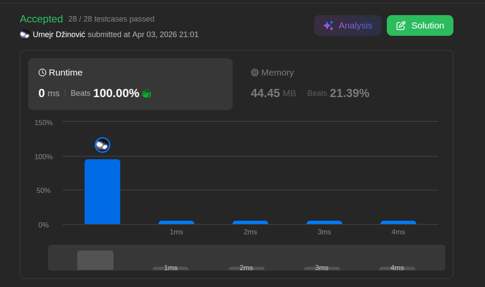

# Reverse Linked List

Ansatz: Singly Linked List
Laufzeit: O(n)
Level: Easy
Memory: O(1)
URL: https://leetcode.com/problems/reverse-linked-list/description/

## Solution

```java
/**
 * Definition for singly-linked list.
 * public class ListNode {
 *     int val;
 *     ListNode next;
 *     ListNode() {}
 *     ListNode(int val) { this.val = val; }
 *     ListNode(int val, ListNode next) { this.val = val; this.next = next; }
 * }
 */
class Solution {
    public ListNode reverseList(ListNode head) {
        
        // 1 --> 2 --> 3
        ListNode last = null;
        ListNode c = head;

        while (c != null) {
            // save the reference of c.next, because the next line overwrites it
            ListNode newHead = c.next;
            c.next = last;
            // move last to index + 1
            last = c;
            // move c to saved reference
            c = newHead;
        }

        return last;

    }
}
```

## Beispiel

<aside>
💡

**Beispiel-Input:** 1 -> 2 -> 3 -> null

Wir nutzen zwei Haupt-Zeiger: `last` (der neue Nachfolger) und `c` (der aktuelle Knoten).

1. **Initialisierung:** `last = null`, `c = 1`.
2. **Schritt 1 (Knoten 1):**
    - Merke dir den Nachfolger: `newHead = 2`.
    - Biege den Pfeil um: `1.next = null` (da `last` null ist).
    - Rücke vor: `last` wird 1, `c` wird 2.
3. **Schritt 2 (Knoten 2):**
    - Merke dir den Nachfolger: `newHead = 3`.
    - Biege den Pfeil um: `2.next = 1` (da `last` jetzt 1 ist).
    - Rücke vor: `last` wird 2, `c` wird 3.
4. **Schritt 3 (Knoten 3):**
    - Merke dir den Nachfolger: `newHead = null`.
    - Biege den Pfeil um: `3.next = 2`.
    - Rücke vor: `last` wird 3, `c` wird null.
5. **Ende:** Die Schleife bricht ab, weil `c` null ist. Wir geben `last` (die 3) zurück.

**Ergebnis:** 3 -> 2 -> 1 -> null

</aside>

## Ansatz

Der Kern dieser Aufgabe ist es, die Richtung der Pfeile (`next`) umzudrehen, ohne den Rest der Liste zu verlieren.

**Die Logik:**

1. **Sicherungskopie:** Bevor du den `next`Pfeil eines Knotens änderst, musst du dir merken, wo es eigentlich hinging (`c.next`). Sonst "reißt" die Kette ab und du findest den Rest der Liste nicht mehr.
2. **Umdrehen:** Du sagst dem aktuellen Knoten: "Dein Nachfolger ist jetzt der Knoten, den wir gerade eben bearbeitet haben (`last`)".
3. **Vorrücken:** Du verschiebst deine Zeiger einen Schritt weiter in die ursprüngliche Richtung.

**Merksatz:**
Sichere die Zukunft (`next`), biege die Gegenwart um (`current.next = last`) und mache die Gegenwart zur Vergangenheit (`last = current`).

## Stats

