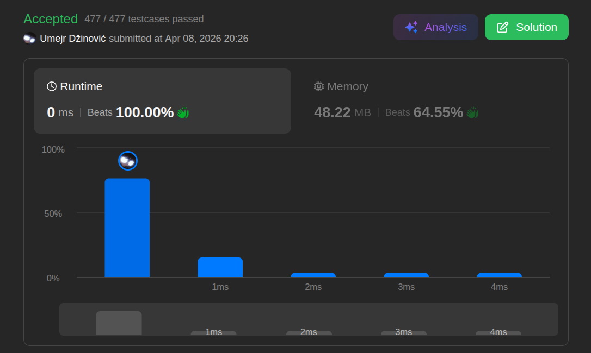

# Reverse String

Ansatz: Zwei Zeiger
Laufzeit: O(n)
Level: Easy
Memory: O(1)
URL: https://leetcode.com/problems/reverse-string/

## Solution

```java
import java.util.List;
import java.util.ArrayList;
import java.util.*;
import java.util.stream.Collectors;

class Solution {
    public void reverseString(char[] s) {

        int left = 0;
        int right = s.length - 1;

        while (left < right) {

            char c = s[left];
            s[left] = s[right];
            s[right] = c;
            left++;
            right--;

        }
    }
}
```

## Beispiel

<aside>
💡

Beispiel-Durchlauf (['h','e','l','l','o']):
1. Tausche s[0] (h) mit s[4] (o) -> ['o','e','l','l','h']
2. Tausche s[1] (e) mit s[3] (l) -> ['o','l','l','e','h']
3. left und right treffen sich in der Mitte -> Fertig!

</aside>

## Ansatz

Man braucht kein neues Array, um ein bestehendes umzudrehen.

- **Zwei Zeiger:** `left` startet bei `0`, `right` startet bei `length - 1`.
- **Der Tausch (Swap):** Speichere den Wert von `left` kurz in einer temporären Variable, überschreibe ihn mit `right`, und setze dann den gespeicherten Wert auf die Position von `right`.
- **Die Bewegung:** Schiebe `left` nach rechts und `right` nach links, bis sie sich in der Mitte kreuzen (`left < right`).

**Merksatz:**
Dies spart Speicher, indem man Elemente wie bei einem Ringtausch direkt an ihrem Index verschiebt.

## Stats

