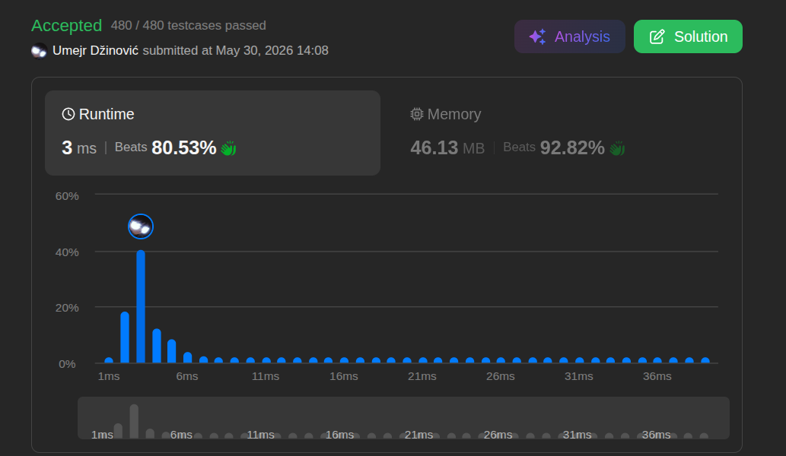

# Reverse Vowels of a String

Ansatz: Zwei Zeiger
Laufzeit: O(n)
Level: Easy
Memory: O(n)
URL: https://leetcode.com/problems/reverse-vowels-of-a-string/

## Solution

```java
class Solution {
    public String reverseVowels(String s) {

        int left = 0;
        int right = s.length() - 1;

        char[] chars = s.toCharArray();

           while (left < right) {
            if (!isVowel(chars[left])) {
                left++;
            } else if (!isVowel(chars[right])) {
                right--;
            } else {
                char temp = chars[left];
                chars[left] = chars[right];
                chars[right] = temp;
                left++;
                right--;
            }
        }
        return new String(chars);
    }

    boolean isVowel(char c) {
        char cleanC = Character.toLowerCase(c);

        if (cleanC == 'a' || cleanC == 'e' || cleanC == 'i' || cleanC == 'o' || cleanC == 'u') {
            return true;
        } else {
            return false;
        }
    }
}

```

## Beispiel

<aside>
💡

| **Schritt** | **left (Zeiger)** | **right (Zeiger)** | **chars[left]** | **chars[right]** | **Bedingung / Aktion** | **Zustand chars** |
| --- | --- | --- | --- | --- | --- | --- |
| 1 | 0 | 4 | 'h' | 'o' | 'h' ist kein Vokal $\rightarrow$ `left++` | `['h', 'e', 'l', 'l', 'o']` |
| 2 | 1 | 4 | 'e' | 'o' | Beide sind Vokale $\rightarrow$ Tauschen, `left++`, `right--` | `['h', 'o', 'l', 'l', 'e']` |
| 3 | 2 | 3 | 'l' | 'l' | 'l' (links) ist kein Vokal $\rightarrow$ `left++` | `['h', 'o', 'l', 'l', 'e']` |
| 4 | 3 | 3 | - | - | Schleife bricht ab, da `left < right` (3 < 3) False ist | `['h', 'o', 'l', 'l', 'e']` |
</aside>

## Ansatz

Dieses Problem wird extrem effizient mit dem **Two-Pointer-Ansatz** (Zwei-Zeiger-Ansatz) gelöst, um den String in einem einzigen Durchlauf zu modifizieren.
• **`char[]`:** Da Strings in Java unveränderlich (*immutable*) sind, konvertieren wir den String zuerst mit `text.toCharArray()` in ein Character-Array. Das erlaubt uns, Zeichen direkt per Index in $O(1)$ auszutauschen. Am Ende verwandeln wir es mit `new String(chars)` zurück.
• **Zwei Zeiger (Two Pointer):** Wir platzieren einen Zeiger `left` am Anfang (Index `0`) und einen Zeiger `right` am Ende (`s.length() - 1`) des Arrays. Die Zeiger wandern in einer `while (left < right)` Schleife aufeinander zu.
• **Flache Verzweigungslogik:** Statt verschachtelter Schleifen prüft die Logik pro Durchlauf genau drei Zustände:
    1. Wenn das Zeichen bei `left` kein Vokal ist, rückt der linke Zeiger weiter (`left++`).
    2. Wenn das Zeichen bei `right` kein Vokal ist, rückt der rechte Zeiger ein Stück ein (`right--`).
    3. Wenn **beide** Zeiger auf einem Vokal stehen, werden die Zeichen getauscht und beide Zeiger bewegen sich weiter.
• **Effizienter Vokal-Lookup:** Die Hilfsmethode `isVowel` nutzt `indexOf` auf dem vordefinierten String `"aeiouAEIOU"`. Das spart die manuelle Konvertierung in Kleinbuchstaben und prüft direkt in konstanter Zeit, ob das Zeichen existiert.

## Stats

