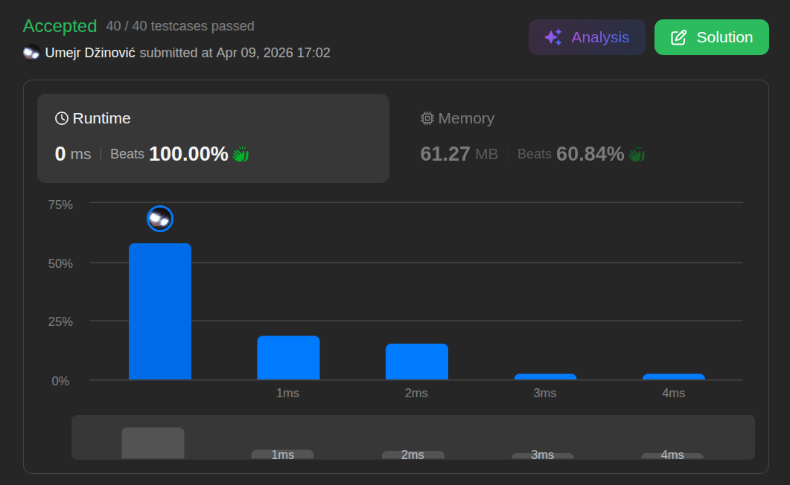

# Rotate Array

Ansatz: Zwei Zeiger
Laufzeit: O(n)
Level: Medium
Memory: O(1)
URL: https://leetcode.com/problems/rotate-array/description/

## Solution

```java
class Solution {
    public void rotate(int[] nums, int k) {

        k = k % nums.length;
				
				// [1,2,3,4,5,6,7]
        switchNumbers(nums, 0, nums.length - 1);

        // [7,6,5,4,3,2,1]

        switchNumbers(nums, 0, k - 1);

        // [5,6,7,4,3,2,1]

        switchNumbers(nums, k, nums.length - 1);

        // [5,6,7,1,2,3,4]
    }

    public void switchNumbers(int[] nums, int left, int right) {

        while (left < right) {
            int num = nums[left];
            nums[left] = nums[right];
            nums[right] = num;
            left++;
            right--;
        }

    }
}

```

## Beispiel

<aside>
💡

**Input:** `nums = [1, 2, 3, 4, 5, 6, 7]`, `k = 3`
1. **Vorbereitung (Modulo):** `k = 3 % 7 = 3`. (Wir rotieren um 3 Stellen).
2. **Schritt 1: Das komplette Array spiegeln** (`0` bis `n-1`)
`[1, 2, 3, 4, 5, 6, 7]` ➜ **`[7, 6, 5, 4, 3, 2, 1]`** *Ergebnis:* Die "Ziel-Zahlen" (5, 6, 7) sind jetzt vorne, aber rückwärts.
3. **Schritt 2: Die ersten $k$ Elemente spiegeln** (`0` bis `k-1`)
Spiegle nur `[7, 6, 5]` ➜ **`[5, 6, 7]`** *Stand des Arrays:* `[5, 6, 7, 4, 3, 2, 1]`
4. **Schritt 3: Den Rest spiegeln** (`k` bis `n-1`)
Spiegle nur `[4, 3, 2, 1]` ➜ **`[1, 2, 3, 4]`** *Endstand:* **`[5, 6, 7, 1, 2, 3, 4]`**

</aside>

## Ansatz

Man nutzt die `reverse(start, end)` Funktion, die wir bei "Reverse String" gelernt haben, als Werkzeug:
• **Schritt 0:** Berechne den echten Versatz: `k = k % nums.length`.
• **Schritt 1 (Total Reverse):** Spiegle das komplette Array (`0` bis `n-1`).
    ◦ *Effekt:* Die hinteren Zahlen sind jetzt vorne, aber in falscher Reihenfolge.
• **Schritt 2 (Partial Reverse 1):** Spiegle nur die ersten k Elemente (`0` bis `k-1`).
    ◦ *Effekt:* Der neue vordere Teil ist korrekt sortiert.
• **Schritt 3 (Partial Reverse 2):** Spiegle den Rest (`k` bis `n-1`).
    ◦ *Effekt:* Der hintere Teil ist auch wieder korrekt sortiert.
**Merksatz:**
Ganzes Array spiegeln, um Positionen zu tauschen. Teile spiegeln, um die Ordnung zu heilen.

## Stats

