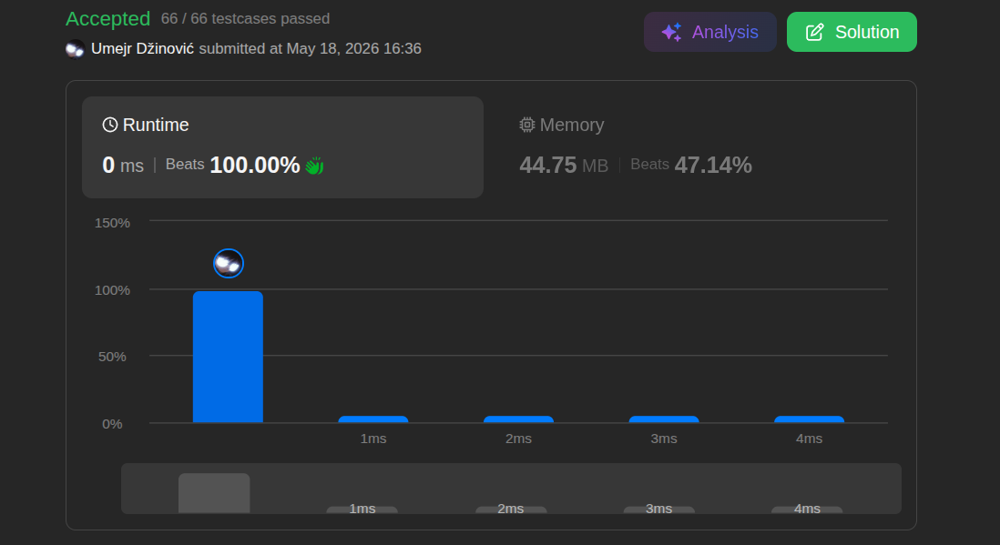

# Search Insert

Ansatz: Binary Search
Laufzeit: O(log(n))
Level: Easy
Memory: O(1)
URL: https://leetcode.com/problems/search-insert-position/

## Solution

```java
class Solution {
    public int searchInsert(int[] nums, int target) {

        int left = 0;
        int right = nums.length - 1;

        while (left <= right) {

            int mid = left + (right - left) / 2;

            if (nums[mid] == target) {
                return mid;
            } else if (nums[mid] < target) {
                left = mid + 1;
            } else {
                right = mid - 1;
            }
        }

        return left;
    }
}
```

## Beispiel

<aside>
💡

| **Schritt** | **left** | **right** | **Berechnung mid** | **nums[mid]** | **Aktion** |
| --- | --- | --- | --- | --- | --- |
| 1 | 0 | 3 | `0 + (3 - 0) / 2 = 1` | 3 | `3 < 5` $\rightarrow$ `left = mid + 1 = 2` |
| 2 | 2 | 3 | `2 + (3 - 2) / 2 = 2` | 5 | `5 == 5` $\rightarrow$ **Return 2** |
</aside>

## Ansatz

Die binäre Suche halbiert in jedem Schritt den Suchraum, was zu einer extrem schnellen, logarithmischen Laufzeit führt. Die Liste **muss** dafür zwingend sortiert sein.

- **Vermeidung von Integer Overflow:** Die Berechnung `mid = left + (right - left) / 2` berechnet mathematisch die Mitte, verhindert aber im Gegensatz zu `(left + right) / 2` einen Absturz bei extrem großen Arrays, da keine Summe das Limit von `Integer.MAX_VALUE` überschreitet.
- **Schleifenbedingung (`left <= right`):** Das `<=` stellt sicher, dass auch Arrays mit nur einem Element oder das letzte verbleibende Element einer Suche korrekt geprüft werden, wenn sich beide Zeiger auf demselben Index treffen.
- **Einfüge-Index:** Wenn das `target` nicht im Array existiert, bricht die Schleife genau so ab, dass der Zeiger `left` automatisch auf dem exakten Index steht, an dem das Element eingefügt werden müsste.

## Stats

