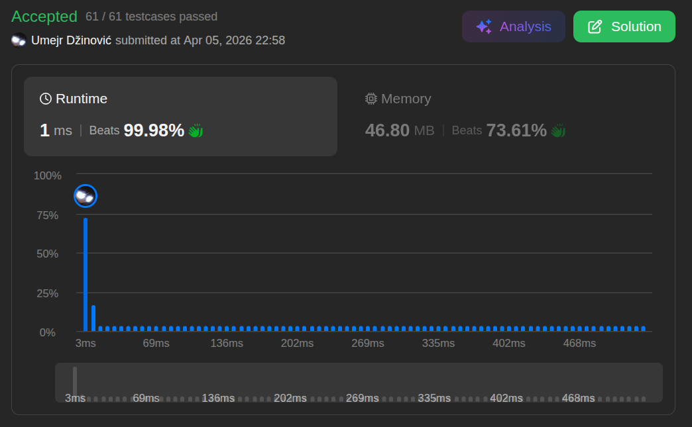

# Single

Ansatz: Einfache iteration
Laufzeit: O(n)
Level: Easy
Memory: O(1)
URL: https://leetcode.com/problems/single-number/

## Solution

```java
class Solution {
    public int singleNumber(int[] nums) {
        
        // [4,1,2,1,2] = 10

        int res = 0;

        for (int num : nums) {
            res = res ^ num; 
            // 0100 --> 4
            // 0101 --> 1 
            // 0111 --> 2
            // 0110 --> 1
            // 0100 --> 4 end resultat
        }

    return res;
    }
} 
```

## Beispiel

<aside>
💡

**Beispiel-Input:** prices = [7, 1, 5, 3, 6, 4]

1. **Tag 1 (Preis 7):** minPrice wird 7. maxProfit bleibt 0.
2. **Tag 2 (Preis 1):** Neuer Tiefstpreis! minPrice wird 1. maxProfit bleibt 0.
3. **Tag 3 (Preis 5):** Kein neuer Tiefstpreis. Aber: 5 - 1 = 4. Neuer maxProfit wird 4.
4. **Tag 4 (Preis 3):** Kein neuer Tiefstpreis. 3 - 1 = 2. (2 ist kleiner als 4, also bleibt maxProfit bei 4).
5. **Tag 5 (Preis 6):** Kein neuer Tiefstpreis. Aber: 6 - 1 = 5. Neuer maxProfit wird 5.
6. **Tag 6 (Preis 4):** Nichts ändert sich.

**Endergebnis:** 5.

</aside>

## Ansatz

Die Kernidee ist, dass man nicht jeden Tag mit jedem anderen Tag vergleichen muss (was O(n²) wäre). Man muss sich nur den **niedrigsten Preis merken**, den man bisher gesehen hat.
**Die Logik:**

1. **Minimieren:** Wir laufen durch das Array und halten Ausschau nach dem absolut kleinsten Wert (unserem potenziellen Kauf-Tag).

2. **Maximieren:** An jedem Tag prüfen wir: "Wenn ich heute verkaufe und zum bisher kleinsten Preis eingekauft hätte, wie viel Gewinn mache ich?"
3. **Update:** Wenn dieser Gewinn größer ist als alles, was wir bisher berechnet haben, speichern wir ihn als neuen Rekord.

**Merksatz:**
Suche während des Laufens immer nach dem billigsten Einkaufsmoment und berechne sofort den Profit für den aktuellen Tag.

## Stats

