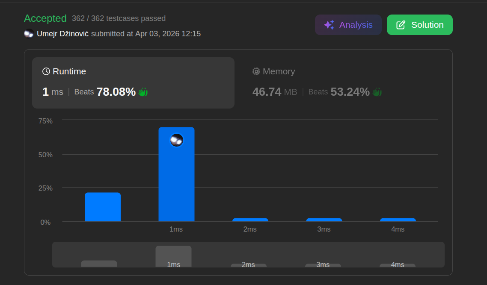

# Remove dublicates from sorted array

Ansatz: Zwei Zeiger
Laufzeit: O(n)
Level: Easy
Memory: O(1)
URL: https://leetcode.com/problems/remove-duplicates-from-sorted-array/

## Solution

```java
class Solution {
    public int removeDuplicates(int[] nums) {

        if (nums.length == 0) {
            return 0;
        }

        int i = 0;

        for (int j = 1; j < nums.length; j++) {

            if (nums[j] != nums[i]) {
                i++;
                nums[i] = nums[j];
            }
        }

        return i + 1;
    }
}
```

## Beispiel

<aside>
💡

**Input:** `nums = [1, 1, 2]`

1. **Start:** `i` steht auf Index 0 (Wert 1). `j` startet bei Index 1 (Wert 1).
2. **Check:** Ist `nums[j]` (1) anders als `nums[i]` (1)? **Nein.** → `j` wandert weiter.
3. **Check:** Ist `nums[j]` (2) anders als `nums[i]` (1)? **JA!**
    - Rücke `i` vor auf Index 1.
    - Schreibe den Wert von `j` (2) auf die Position von `i`.
    - `nums` sieht jetzt so aus: `[1, 2, 2]`.
4. **Ende:** Die ersten zwei Zahlen `[1, 2]` sind eindeutig. `i + 1 = 2`.
</aside>

## Ansatz

Der Fehler vieler Anfänger ist es, Elemente wirklich "deleten" zu wollen. Das ist in Arrays teuer O(n) / vorgang.

**Der Trick:** Wir nutzen die Sortierung aus. Da Duplikate nebeneinander stehen, lassen wir einen schnellen Zeiger (`j`) vorlaufen. 

Nur wenn er etwas Neues findet, darf der langsame Zeiger (`i`) es "dokumentieren".

**Merksatz:**

> Nutze zwei Zeiger, um das Array in einem Durchlauf "einzudampfen". Der eine sucht Neues, der andere überschreibt das Alte.
> 

## Stats

