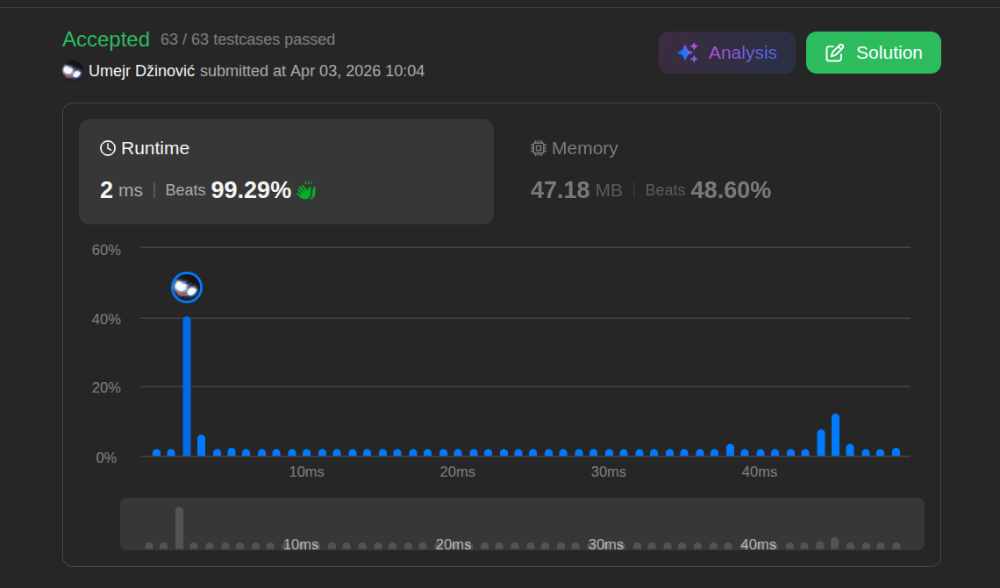

# Two Sum

Ansatz: Hash
Level: Easy
Notes: Two Sum (https://www.notion.so/Two-Sum-3374e760adb38002bd58e7940e763dca?pvs=21) 
Text: O(n)
URL: https://leetcode.com/problems/two-sum/

## Solution

```java
import java.util.HashMap;
import java.util.Map;

class BetterSolution {
    public int[] twoSum(int[] nums, int target) {

       Map<Integer, Integer> solution = new HashMap<>();

        for (int i = 0; i < nums.length; i++) {

            int com = target - nums[i];

            if (solution.containsKey(com)) {
                return new int[]{solution.get(com), i};
            }

            solution.put(nums[i], i);
        }

        return new int[]{}; 
    }
}
```

## Beispiel

<aside>
💡

### Ein Beispiel-Ablauf, der es klick machen lässt:

`nums = [4, 10, 3]`, `target = 7`

1. **Zahl ist 4:**
    - Suche nach `3` (7-4).
    - Ist `3` in der HashMab? **Nein.**
    - Speichere die **4** in die HashMab. (HashMab: `{4: Index 0}`)
2. **Zahl ist 10:**
    - Suche nach `3` (7-10).
    - Ist `3` in der HashMab **Nein.**
    - Speichere die **10** in die Map. (HashMab: `{4: 0, 10: 1}`)
3. **Zahl ist 3:**
    - Suche nach **4** (7-3).
    - Ist **4** in der HashMab? **JA!** (An Index 0).
    - **BUMM!** Du hast die Lösung: Index 0 und Index 2.

Diese formell ist die schnellste, weil man nicht durch ale i’s und j’s gehen muss, stattdessen berechen wir einfach den RestWert, wenn der nicht exisitert, kommt die aktuelle Zahl die zum Rest resultiert ist, in die hashMab. 

</aside>

## Ansatz

Der normale Mensch denkt, wenn ich zwei Zahlen suche, muss ich mir auch zwei Zahlen anschauen. Das war mein erster Fehler. Denn wir kennen das target, und wir kennen die aktuelle zahl. Das heißt, wenn also `y + x = t` ergeben, dann muss `y = t - x` auch stimmen. Dadurch kennen wir also bereits das target immer und die aktuelel zahl. Wir müssen also laut der Formel arbeiten und nur in die Hashmap schauen. 

Merksatz: 

> In dem Moment, in dem du die **Subtraktion** nutzt, verwandelst du ein "Such-issue mit zwei Unbekannten" in ein **"Such-Issue mit einer Unbekannten"**.
> 

## Stats

